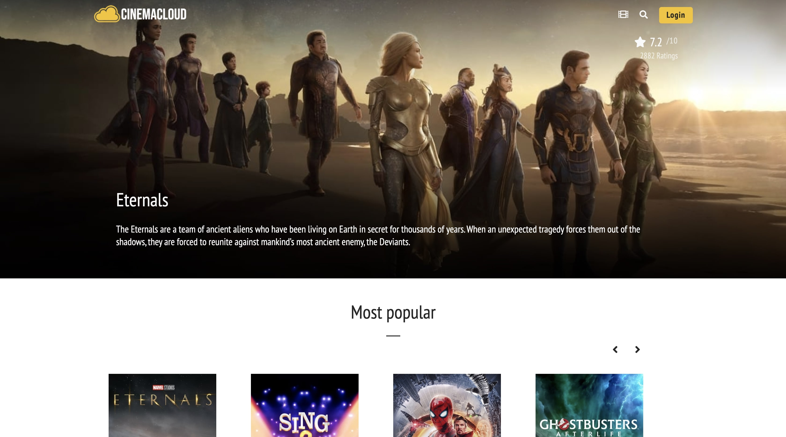
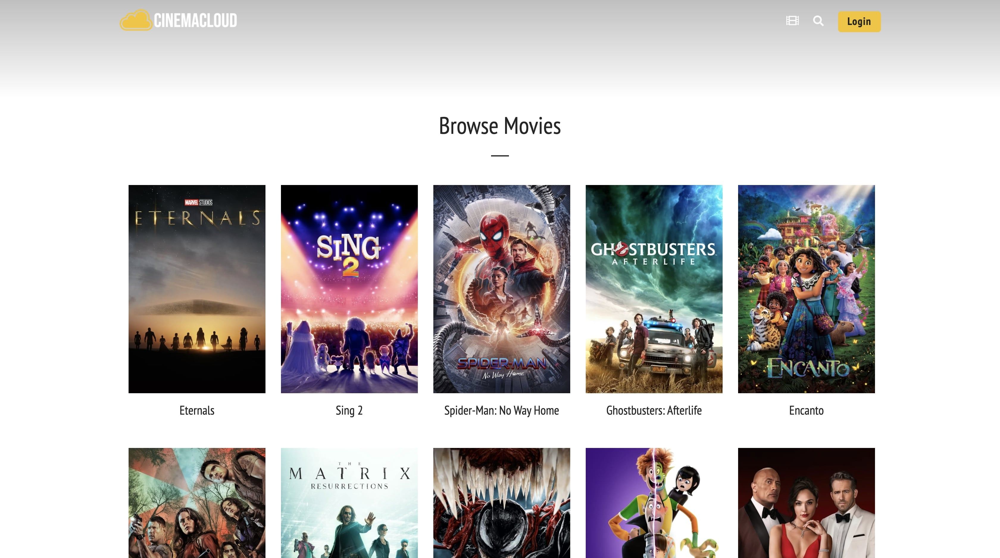

<div id="top"></div>

# Introduction

The cinemacloud app provides efficient support for searching for movies, obtaining movies data and creating a user account for gathering the most favourite movies by the user.

<a href = "https://cinemacloud.netlify.app/" target= "_blank">Visit the Site</a>

## Screenshots 
Below you'll find some screenshots of the app.

`Home Page`
<p align='center'>
    
</p>

`Movies Page`
<p align='center'>
    
</p>

`Login Page`
<p align='center'>
    
</p>

`User Panel`
<p align='center'>
    
</p>

<p align="right">(<a href="#top">back to top</a>)</p>

## Main goals

- [x] fetch movies data from the online API [TMDB](https://www.themoviedb.org/)
- [x] create an user account
- [x] use the database provided by [Google Firebase](https://firebase.google.com/).
- [x] use [HookState](https://hookstate.js.org/) state management to handle data flow
- [x] use `dotenv` to separate sensitive data
- [x] use React hooks and create custom hooks
- [x] use own webpack [boilerplate](https://github.com/SzymonGos/react_webpack_babel_sass)

<p align="right">(<a href="#top">back to top</a>)</p>

## How to use

1. Get a free movies API Key at [The Movie Database](https://www.themoviedb.org/)
1. Get a free API Key at [Google Firebase](https://firebase.google.com/)
3. Clone the repo
   ```sh
   git clone https://github.com/SzymonGos/cinema_cloud.git
   ```
4. Install NPM packages
   ```sh
   npm install
   ```
5. Create `.env` file and enter details by following `.env.example` file
6. Run `npm start` and listen on port: 
   ```sh
   http://localhost:8080/
   ```

## What I learnt

There are several outcomes of this project:

* Planning the file structure in advance has helped me organize my workflow better and eliminate the feeling of being overwhelmed by working with many files.
* Used state management helped me to access data from one source and prevent prop drilling.
* Learnt how to use user authentication and Firestore Database from Google Firebase. 

<p align="right">(<a href="#top">back to top</a>)</p>